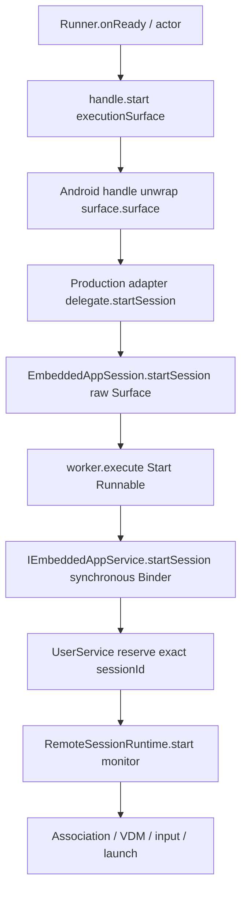
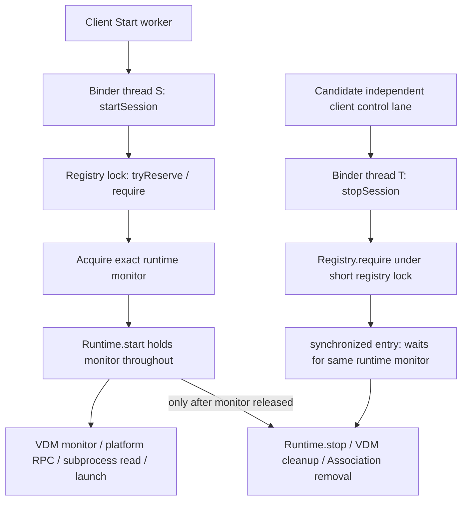

# DWT-VDM-009 — Task 3E: Hung Start IPC / Terminal Detachment

**Ngày:** 2026-10-01 (Asia/Saigon). **Loại:** SOURCE/ARCHITECTURE ANALYSIS ONLY.

**Quyết định duy nhất: `BLOCKED_REQUIRES_RUNTIME_PROTOCOL_REDESIGN`.**

Tách lane phía client và bỏ reference sau terminal là các thay đổi cục bộ có thể thiết kế được, nhưng chưa đáp ứng toàn bộ điều kiện FEASIBLE. Remote Start giữ monitor của exact session trong khi cấp phát/launch; remote Stop phải lấy cùng monitor. Khi Start treo tại đó, Stop không thể thực thi cleanup. Stop đến trước reserve cũng không ghi cancellation/tombstone để ngăn Start cấp phát muộn. Bookkeeping operation phía client hiện giả định serialization theo session, không hỗ trợ hai operation đồng thời. Đây là bằng chứng source đủ để bác bỏ phương án chỉ tách executor và dọn terminal holder.

Task 3D COMPLETE / PASS cho connection-readiness boundary theo đầu vào của task; không chạy lại hay mở rộng PASS đó sang Start. Task 3B vẫn BLOCKED. Tasks 4–9 NOT AUTHORIZED. Báo cáo không cấp phép sửa runtime/protocol, không kết luận phải viết lại toàn bộ 006/007 hoặc nhất thiết đổi chữ ký AIDL. **STOP FOR REVIEW.**

## 1. Phạm vi và căn cứ

Chỉ tạo tài liệu này. Không sửa production/tests, dependency, license/security, database, 006/007 contract hoặc trạng thái tài liệu khác. Không build/test/device, stage/commit/push. Phân tích working tree hiện tại, có sẵn thay đổi của người dùng; không coi HEAD là source của Task 3D.

| Nguồn | Vị trí dùng trong báo cáo |
| --- | --- |
| [S1 — EmbeddedWorkspaceRunner][runner] | 23–56: scope/channel/holders; 59–183: command admission; 186–261: snapshots/timeouts; 264–363: startup; 365–533: cleanup/result/receipt. |
| [S2 — AndroidEmbeddedWorkspaceSessionFactory][factory] | 32–58: factory/observer; 62–107: delegate, unwrap Surface, detach. |
| [S3 — EmbeddedAppSession][session] | 44–89: fields/mailboxes; 190–198: detach; 200–241: Start; 252–334: touch/Stop/Close. |
| [S4 — IEmbeddedAppService][aidl] | 4–11: synchronous AIDL, exact session ID và `in Surface`. |
| [S5 — EmbeddedAppUserService][service] | 13–19: reserve rồi Start; 27–37: Stop/state response; 50–61: destroy/result. |
| [S6 — RemoteSessionRegistry][registry] | 16–39: registry lock và entry monitor; 41–50: inventory. |
| [S7 — RemoteSessionRuntime][remote-runtime] | 19–48: Start giữ monitor; 56–80: Stop và startup subprocess. |
| [S8 — EmbeddedAppVdm][vdm] | 32–45, 85–125: resource/Surface holders và allocation; 265–328: cleanup/reference release; 438–441: blocking subprocess. |
| [S9 — EmbeddedAppSessionState][session-state] | 18–58: bounded lane/mailbox; 119–188: lifecycle guards; 193–217: empty-state evidence. |
| [S10 — EmbeddedAppServiceConnectionManager][manager] | 27–106: operation inventory; 161–179: absence/lease; 200–218: registrations; 319–358: reconcile/detach/release; 405–412: transport fields. |
| [S11 — AndroidEmbeddedWorkspaceExecutionSurface][surface-wrapper] | 5–10: raw Surface và injectable validity closure. |
| [S12 — EmbeddedWorkspaceRuntimeModels][models] | 17–47: launch payloads; 72–114: value-only receipts/results. |
| [S13 — EmbeddedWorkspaceRenderer][renderer] | 83–109: SurfaceView/bridge/holder Surface, production wrapper dùng default validity closure. |
| [S14 — SessionStopCoordinator][session-models] | 96–108: một logical Stop và điều kiện release lease. |

Contract lifetime: [Task 3S](2026-10-01-dwt-vdm-009-in-process-scope-amendment.md), mục “Bounded UI retention và terminal result”, cho phép graph host cũ tồn tại tạm trong **một cleanup operation có terminal hữu hạn**; sau terminal phải kết thúc scope/waiter/callback và giải phóng route graph, cả khi kết quả incomplete. [Task 3A](2026-10-01-dwt-vdm-009-task3-ui-independent-cleanup-boundary.md) và [Task 3C](2026-10-01-dwt-vdm-009-task3c-bounded-connect-boundary.md) là nền tham chiếu; đối chiếu lại source sau 3D khi graph đã thay đổi.

## 2. Exact Start capture graph

### 2.1. Chuỗi gọi



S1:308–332, S2:70/89–94 và S3:200–241 cho thấy `handle.start()` trả về sau enqueue; Binder không chạy trực tiếp trên runner actor. ACTIVE timer chỉ được lập sau `handle.start()` trả về. Với production executor hiện tại, hung Start Binder tự nó không chặn actor: actor vẫn xử lý Stop/SurfaceLost/ACTIVE timeout và lập cleanup timer. Đây là phân tích đường gọi, không phải runtime latency PASS; không bảo đảm một implementation handle khác hoặc dispatcher bị chặn bởi công việc khác.

### 2.2. Capture của Start Runnable đang queued/running

| Capture theo source | Đường reachable |
| --- | --- |
| `service` local | Exact `IEmbeddedAppService` được chọn lúc submission; production là proxy của UserService riêng, không tự chuyển sang Binder mới khi reconnect. |
| `surface` parameter | Raw `android.view.Surface` được unwrap; không capture `EmbeddedWorkspaceExecutionSurface` wrapper trực tiếp trong Start lambda. |
| `ownedLease` local | `EmbeddedAppServiceLease` → `owner` manager → registrations, finalization và transport. |
| `EmbeddedAppSession.this` | Lambda đọc `target`, `sessionId`, ghi `startedRemotely`, dùng `main`, `lifecycle`, `state`, `publishLifecycle()/update()`. Các field này không phải capture giá trị độc lập. |

Khi worker đang chạy, local `geometry` là value data của target; Binder proxy/Parcel/frame cũng giữ đối số transport và trạng thái reply cần cho call. Sau reply, `result` được capture bởi `main.execute { ... }`, closure này tiếp tục giữ session. Tên field synthetic cụ thể của lambda chưa kiểm tra bytecode; bảng trên là capture bắt buộc theo các truy cập source, không suy stack slot/liveness tối ưu của ART.

```text
GC root: worker Thread / running Runnable hoặc executor queue
  → Start Runnable
      → raw Surface
      → exact service proxy
      → ownedLease → shared manager → registration mailbox → listener → session
      → EmbeddedAppSession
          → target / lifecycle / coordinators / worker / main
          → notifications.consumer
              → lifecycleChanged → adapter mailbox.consumer → runner observer
                  → runner → preparedItems[*].executionSurface
                           → ownedItems[*].prepared.executionSurface
                           → sessionFactory / runnerScope / channel / reply waiters
          → ingress.consumer / uidMailbox.consumer (đến khi detach)

runner observer được tạo tại S1:278–280, gửi Event.Snapshot qua events.
runner → sessionFactory → applicationContext → Application-owned scopes
  có thể reach route Jobs còn sống; product wiring là đường gián tiếp bổ sung.
```

Không giả định runner có direct field `renderer`/`Activity`. Route có renderer/controller trỏ vào runner; chiều ngược chỉ xuất hiện qua closure/dependency/continuation còn sống hoặc Application scopes. [Product screen][product-screen]:114–137 tạo runner bằng Main.immediate, factory dùng applicationContext và các closure product capture renderer; [Application][application]:52–56 có process scope/child run scope. Scope cũ chưa kết thúc thì các child Job/waiter có thể giữ route. `AndroidConnectionTransport(app)` hiện chỉ dùng packageName để tạo args, **không lưu field app Context**; không tái sử dụng đường `manager.app → Application` từ phân tích source cũ.

Nếu Binder không bao giờ trả về: phần sau S3:214–215 không chạy; `startedRemotely` chưa được đặt true bởi task, Start operation chưa `operationFinished()`. Session, lease/manager và Surface capture vẫn có thể reachable vô hạn; Stop/Close Runnable đã enqueue cũng còn trong cùng executor queue. `worker.shutdown()` không hủy task đang chạy hoặc bỏ các task đã enqueue. Timeout runner chỉ chốt kết quả incomplete/recovery, không kết thúc Binder hoặc tạo clean evidence.

### 2.3. Có thể detach callback trong lúc Start treo?

**Có, với giới hạn rõ ràng.** `finishCleanup()` S1:486–492 gọi từng `handle.detachNotifications()` sau khi copy result. Adapter S2:104–107 detach observer mailbox rồi session detach. S3:190–198 invalidate UID/candidate, detach ingress, lifecycle/state notifications và lease registration; không join Start worker. S9:44–58 giữ consumer trong AtomicReference, delivery queued giữ mailbox/value và đọc consumer lúc delivery, nên detach cắt consumer cho delivery chưa bắt đầu.

Delivery đã lấy consumer và đang thực thi có thể giữ local consumer tới khi callback trả về; detach không phải barrier chờ callback in-progress. Observer production chỉ `trySend` value event; S1:187 chặn late snapshot khi đã terminal. Start Runnable vẫn capture session/lease/Surface sau detach. Main completion closure của Start hiện **không** dùng detachable value mailbox: nó vẫn giữ session khi được enqueue sau một reply muộn. Detach callback là một phần của lifetime boundary, không phải acknowledgement đã bỏ mọi capture.

## 3. Remote Start/Stop concurrency graph và proof

Tất cả method AIDL hiện synchronous, không có `oneway`. Binder có thể dispatch các transaction lên threadpool; thread client chờ reply, nhưng số thread khả dụng và scheduling không tạo guarantee cleanup. [Tài liệu Binder threading của AOSP](https://source.android.com/docs/core/architecture/ipc/binder-threading) mô tả synchronous wait và threadpool. Chặn quyết định ở đây là monitor trong source ứng dụng.



S5 Start reserve/lookup xong mới gọi runtime Start: registry lock không giữ suốt allocation. Tuy nhiên S7:19 `@Synchronized start` giữ **runtime instance monitor** qua AssociationShell.create, `vdm.create`, prepareTouchscreen, waitForStableFingerConfig và launchTarget. S6:35 `synchronized(entry)` trong Stop lấy chính runtime instance đó; S7:56 `@Synchronized stop` lấy lại cùng monitor theo reentrancy. Stop của session khác không bị monitor này chặn, nhưng vẫn có giới hạn Binder pool/platform riêng.

**Counterexample đủ để bác bỏ convergence:** Start của session X vào monitor, cấp phát association hoặc device rồi treo trong platform RPC/subprocess. Stop(X) được gửi từ thread khác, được Binder dispatch, `registry.require(X)` thành công, nhưng chờ monitor X vô hạn. Không chạy `phase = STOPPING`, `vdm.cleanup()` hay remove association. VDM còn có monitor riêng tại create/launch/cleanup, nên chỉ bỏ outer runtime monitor cũng chưa chứng minh an toàn. “3 giây” tại S7:70 không bound `readText()` của subprocess bên trong vòng lặp; S8:438–441 cũng đọc/chờ subprocess synchronous.

**Phân biệt pending reply với pending execution:** nếu Start đã ra khỏi runtime monitor nhưng client vẫn chưa nhận reply, Stop có thể lấy monitor và clean exact session; entry STOPPED vẫn ở registry và Start mới cùng ID bị từ chối. Trường hợp này không cứu Start treo trong critical section. Nếu Start chưa reserve, Stop không tìm thấy ID và không tạo entry/tombstone. Không thể chứng minh remote Stop luôn execute/converge trong khi original Start transaction vẫn pending.

## 4. Race matrix — giữ authority và fail closed

| Interleaving của exact Binder/session | Hành vi source / thiếu contract | Kết quả được phép |
| --- | --- | --- |
| Start giữ runtime monitor + Stop tới | Hiện Stop còn nằm sau Start ở client worker. Tách lane chỉ chuyển chỗ chờ sang remote `synchronized(entry)`. | Timeout → incomplete; không clean, không nhả gate theo timeout. |
| Start đã release runtime monitor, reply chưa đến + Stop tới | Stop có thể clean exact entry; entry STOPPED được giữ, duplicate ID bị từ chối. Reply Start success có thể tới sau Stop. | Clean chỉ theo exact Stop success và local lease/ownership contract đã hoàn tất; reply Start không resurrect. |
| Stop intent local trước Start invocation thực sự | Queued Start lambda không kiểm tra closed/stopping lại lúc chạy. Worker hiện vẫn gọi Start rồi mới Stop. | Stop intent không chứng minh no-allocation; cần giữ ownership/evidence. |
| Stop remote tới trước reserve, Start cấp phát sau đó | `require()` không thấy ID; Stop không ghi intent. Original Start có thể `tryReserve()` thành công về sau. | Unknown/absence tại một thời điểm không fence allocation tương lai; incomplete/uncertain. |
| Reserve xong, Stop lấy monitor trước Start | Stop cleanup empty runtime, đặt STOPPED; Start vào sau fail `check(phase == RESERVED)` **ngoài try**. Registry không xóa entry. | Exact Stop success có thể là evidence ngăn allocation của ID này; vẫn cần client bookkeeping/lease acknowledgement đúng. |
| Start success reply tới sau terminal timeout | Lifecycle chỉ cho STARTING → ACTIVE; Stop đã đổi phase. Runner bỏ snapshot khi terminal. | Giữ cached incomplete/recovery/failure; không đổi result hoặc nhả gate, không tự cleanup retry. |
| Start failure sau Stop intent | Khi Start ném bên trong try, catch đổi FAILED và gọi reentrant `stop()`; cleanup này cũng có thể treo/fail. Khi check đầu hàm fail, Binder trả exception, không Bundle failure của runtime. | Start failure không tự chứng minh clean; chỉ exact cleanup acknowledgement hợp lệ. |
| UserService chết trong pending Start | Binder có thể trả exception và connection event REMOTE_DIED. Resource outcome vẫn theo 006; không suy platform resources sạch từ death. | RecoveryRequired nếu evidence death tới đúng run; nếu chưa có evidence thì incomplete/uncertain. |
| Stop trả UNKNOWN_SESSION trong khi Start có thể tạo resources | **Literal hiện tại:** S5:27–29 đổi lỗi unknown của Stop thành `STOP_FAILED`, không `UNKNOWN_SESSION`. `getSessionState` mới trả `UNKNOWN_SESSION` kèm ID tại 31–37. Một future Stop response UNKNOWN vẫn không có tombstone. | Không clean theo unknown đơn lẻ; không coi point-in-time absence là no-future-allocation proof. |
| Reconcile exact absence + empty service khi Start còn pending | Hiện serialization + `inFlight` ngăn reconcile hợp lệ trong pending Start. Khi tách lane naïve, set theo session ID có thể bị Stop completion xóa sớm. | Không dùng kết quả reconcile để clean khi original Start chưa được fence/acknowledge. |

Không đổi authoritative evidence thành “best effort clean”. Success Start, timeout, local close, lost Surface, Binder exception/death, service count rỗng hoặc callback đã detach đều không tự chứng minh toàn bộ owned set sạch.

### 4.1. Client ordering/bookkeeping là blocker riêng

S10:27–54 dùng `linkedSetOf<String>` cho inFlight; `operationStarted(id)` chỉ thêm một lần và `operationFinished(id, ...)` xóa một ID. Nó không đếm hoặc định danh hai operation Start/Stop đồng thời của một session. S3 chỉ đặt `startedRemotely = true` **sau** Start reply; Close S3:310–329 dùng flag đó để quyết định remote cleanup/clean result. S14 giữ một logical Stop, không tạo admission fence cho pending Start.

Counterexample nếu chỉ tách executor:

```text
Start operationStarted(X) → inFlight = {X}; Start chưa reserve ở remote
Stop operationStarted(X)  → vẫn {X}
Stop trả STOP_FAILED      → operationFinished(X, false) xóa X
reconcile: exact session absent + service empty + current generation/revision
                         → có thể vượt điều kiện inFlight rỗng
Close release lease và có thể báo clean
Original Start về sau reserve X và cấp phát resources
```

Không xảy ra theo ordering single worker hiện tại; là lý do không được giữ nguyên bookkeeping rồi tách lane. Ngoài ra Close riêng có thể thấy `startedRemotely == false` trong khi Start đã submitted nhưng chưa reply. Runner hiện gọi Stop trước Close, khiến `mayReleaseLease` chờ Stop completion; đó không phải contract đủ cho mọi interleaving sau khi tách lane. Thiết kế mới phải tách “đã submit/may allocate”, “Stop requested”, “remote allocation fenced/clean acknowledged” và identity của từng operation, không đổi thành clean chỉ từ flag false.

## 5. Surface retention finding

Ba đối tượng phải phân biệt: execution wrapper, raw Java Surface và native/remote transport graph.

1. **Wrapper trong repo:** S11 giữ `surface` và `validityQuery`; closure injectable có thể capture UI tùy caller. S13 production tạo wrapper bằng default closure chỉ đọc raw Surface. Adapter S2 unwrap đúng raw object; Start lambda không capture wrapper/SurfaceView/bridge trực tiếp. Runner prepared/owned holders vẫn giữ wrapper cho tới sau terminal hiện tại.
2. **AOSP Java Surface:** các field gồm lock/name/native pointer, Canvas/Matrix, optional HwuiContext. Không thấy strong field SurfaceView/Activity/Compose/renderer của ứng dụng; inner Canvas/HwuiContext quay lại Surface, không tự quay lại host. HwuiContext có HardwareRenderer riêng nếu dùng drawing API. Class comment nói consumer có thể được reclaim dù còn Surface. Vì thế không chứng minh “raw Surface luôn giữ Activity”; cũng không gọi nó chỉ là một integer harmless. Parcel code tạo/read Surface transport thay vì gửi Java host graph. [AOSP Surface.java](https://raw.githubusercontent.com/aosp-mirror/platform_frameworks_base/master/core/java/android/view/Surface.java), vùng 47–60, 117–137, 748–779, 1291–1361.
3. **Native object:** JNI giữ ref-counted native Surface; native Surface giữ producer/graphics state. Native/Binder references có thể sống độc lập Java consumer. Transport không chứng minh buffers/display/device đã cleanup hoặc raw object còn valid. [AOSP JNI Surface tại revision e0938b8](https://android.googlesource.com/platform/frameworks/base/+/e0938b8/core/jni/android_view_Surface.cpp), `android_view_Surface_createFromSurface`; [AOSP native Surface.cpp](https://android.googlesource.com/platform/frameworks/native/+/master/libs/gui/Surface.cpp), constructor/`mGraphicBufferProducer`. JNI revision này là căn cứ cấu trúc, không phải source firmware thiết bị.
4. **Chiều sở hữu của host:** SurfaceView có `mSurface`, holder trả nó; khi detach, `releaseSurfaces()` destroy Surface/BLAST state. Giữ raw object không ngăn host destroy native state của object; mất host không hủy Start transaction hoặc resource remote đã nhận. [AOSP SurfaceView.java](https://raw.githubusercontent.com/aosp-mirror/platform_frameworks_base/master/core/java/android/view/SurfaceView.java), field `mSurface`, `onDetachedFromWindow`, `releaseSurfaces`.

**Kết luận theo source:** đường giữ session/runner hiện tại được chứng minh qua Start lambda/observer/holders, không cần giả định raw Surface có back-reference tới View. Không tìm thấy direct Java host back-edge trong raw AOSP Surface của đường production đã xem. Native callback/producer graph trên firmware Samsung cụ thể, ART stack liveness và heap reachability thực tế **NOT VERIFIED**; AOSP master và JNI revision không phải attestation cho mọi API 28–37/vendor build.

Nếu permanently blocked task giữ **route graph hoặc route-owned execution Surface graph** vô hạn, nó vi phạm bounded-lifetime contract 3S: terminal phải cho scope cũ bỏ graph, không chỉ trả timeout. Một raw Surface object đã bị host destroy có thể chỉ còn object/native transport riêng, nên không suy object đó đồng nghĩa whole route leak. Muốn cho phép detached transport tồn tại vô hạn phải chứng minh không còn đường tới old route và phân định ownership/lifetime transport; báo cáo này không tự cấp ngoại lệ đó. Bỏ reference không được gọi `Surface.release()` từ runner/adapter để thay host ownership hoặc giả cleanup acknowledgement.

## 6. Candidate Start/control lanes — chưa được cấp phép

### 6.1. Standalone immutable StartIpcTask

Có thể viết task top-level/static theo mẫu `UidVerificationTask`, với field duy nhất: exact service proxy/Binder, copied sessionId, copied target/geometry scalars, required raw Surface/transport, và detachable mailbox của **value completion**. Operation/generation identity nếu cần phải là copied values. Không truyền lease/manager, target provider, session `this`, observer, runner/controller/renderer, Context/View/Activity hoặc closure validity/UI.

```text
bounded Start lane → StartIpcTask
  → exact Binder + sessionId + package/component/geometry values
  → required Surface transport
  → DetachableMailbox<StartCompletion values>
       consumer = null after terminal
```

Task không được load consumer vào local trước Binder hoặc capture nó trong `finally`/continuation. Completion chỉ chứa validated values và error string/code; không giữ Throwable/cause chain hoặc arbitrary callback objects. Mailbox executor cũng phải độc lập route. Queued delivery giữ mailbox/value, không giữ session closure. Hung task như vậy có thể tách session/callback **ở mức Java field graph**, còn Surface/native graph phải thỏa mục 5. Không có implementation hiện tại để tuyên bố lifetime PASS. Nếu chọn transport copy, việc copy có thể cấp thêm native reference; không coi clone là giải pháp đã chứng minh.

Lane Start cần admission hữu hạn, không caller-runs, không retry hay tạo thread vô hạn sau mỗi timeout. Queue chưa chạy cần payload detach/drop được khi terminal; task đã vào Binder không thể giả định bị `cancel()/interrupt()/shutdownNow()` cắt đứt. Saturation phải trả failure value trước invocation nếu thực sự chưa submit; không biến đã submitted thành no-allocation.

### 6.2. Control/cleanup

Control lane riêng có thể enqueue Stop cho exact Binder/session trong khi Start lane bị treo; actor chỉ submit và chờ value snapshot/timeout. Touch nên giữ ordering theo ACTIVE/stop fence; một Touch IPC hung cũng không được chiếm lane cleanup. Close phải invalidate local delivery, release đúng lease theo acknowledged ownership state; không join hung Start. Control task/mailbox cũng không được giữ route lâu hơn deadline.

Đó mới là independence phía client. Với remote hiện tại, Stop vẫn chờ runtime/VDM monitors. Contract remote tương lai phải giải quyết cancellation/admission trước reserve, ownership của resource được allocate sau intent, cleanup trong pending allocation và authoritative acknowledgement “không còn allocation tương lai cho exact identity”. Chỉ bỏ `@Synchronized`, thêm volatile stop flag, đổi `oneway`, thêm timer hoặc kill shared UserService không chứng minh invariants này. Stop còn có thể hung trong chính cleanup platform RPC. Chưa chọn một protocol redesign cụ thể và không mở global cleanup/process-death recovery.

## 7. Narrow terminal runner detach design

**Đối với runner-local holders, có thể clear sau khi copy đầy đủ result.** `cleanupNext()` không đọc executionSurface; `toReceipt()` chỉ cần plan metadata, handle.sessionId và latest snapshot. `finishCleanup()` hiện tạo copied receipts/outcomes/partial receipt và `allOwnedSessionsClean` trước terminalResult. Các result/receipt tại S12 là value data, không chứa Surface/handle/observer. Clear maps sau điểm này không tự làm mất reverse rollback evidence hoặc cached terminal result.

| Holder | Thiết kế terminal tối thiểu |
| --- | --- |
| `preparedItems` | Gán emptyList sau khi chốt result; chưa clear trước khi startup/cleanup consumers đã bị fence. Có thể thiết kế bỏ launch holder sớm hơn khi beginCleanup, nhưng không cần cho riêng terminal clear. |
| `ownedItems`, session handles | Copy receipts, partialReceipt, owned count, ordered outcomes trước. Detach tất cả observer rồi clear map; chỉ giữ metadata giá trị cần cho terminal API. Handle/session có IPC riêng đang hung chưa được giải phóng bởi clear này. |
| `currentStartupSourceId`, startup index | Null/reset sau khi terminal; không còn next Start. |
| `executionSurface` refs | Bỏ cả prepared list và OwnedItem.prepared, không chỉ một đường. Không release host Surface. |
| `phaseWaitJob`, `cleanupWaitJob` | Cancel và null; clear phase/source, invalidate tokens. Timer enqueue muộn bị terminal fence/drop. |
| `cleanupReason/order/outcomes/index/source` | Snapshot result giữ evidence trước; clear transient fields/list sau. `cleanupActive = false`. |
| `startReply`, terminal waiters | Complete các reply chưa complete bằng cùng terminal result; null/clear. Start reply đã trả Started không bị ghi lại. |
| Observer callbacks | Dùng hook detach hiện có sau copy, xử lý delivery in-progress như mục 2.3. Không giữ danh sách detached handle dài hạn. |
| Queued `Event.Start(request, reply)` | Admission terminal phải chặn/drop hoặc drain thành DuplicateCall, bỏ request/Surface payload và complete reply; chỉ close channel không đủ. |
| Channel/event actor | Chốt result/admission, resolve/drop toàn bộ queued commands, bỏ value notifications rồi kết thúc receiver. Không để caller await reply không bao giờ complete. |
| `preflight`, `sessionFactory`, dispatcher/scope context | Production policy là frozen values; factory giữ Application Context. Injected dependency/context có thể capture UI tùy caller. Nếu còn giữ runner object để gọi cached Stop, phải bỏ các dependency không còn dùng hoặc chứng minh chúng không giữ old route. |

Thứ tự an toàn đề xuất: (1) tạo toàn bộ terminal result từ owned set còn nguyên; (2) publish một cached result bất biến và đóng admission bằng local synchronization hữu hạn; (3) detach observers, cancel timers; (4) complete start/waiters và mọi pending command; (5) clear holders/dependencies; (6) thoát actor/cancel root scope. Result không đọc lại map đã clear. CleanupIncomplete vẫn là incomplete dù runner phase hiện gán FAILED_CLEAN; tên phase không được đổi thành clean evidence.

S1:187 đã ngăn late snapshot mutate result. Lifecycle S9:125–188 cũng không chuyển STOPPING/terminal về ACTIVE do reply Start muộn. Future terminal admission và mailboxes cần giữ thêm operation/generation guards, không restart item tiếp theo hay revive run. Late transport completion chỉ bị drop ở delivery, không sửa cached result và không âm thầm nhả gate.

**006 tests:** clearing sau materialization không đổi value semantics về receipts/partial receipt/count/rollback order. Tuy nhiên compatibility của implementation mới **NOT VERIFIED**: cần chạy lại affected tests khi được cấp phép. [RunnerTest][runner-test]:67–94 kiểm tra primary failure, C/B/A order, incomplete và stop/close; 119–151 kiểm tra repeated Stop/Stop trong startup; 260–286 kiểm tra timeout/death; 307–322 kiểm tra detach và late READY. [AdapterTest][adapter-test]:123–153 bảo vệ host Surface ownership và observer detach. Không suy runner fake chứng minh remote hung-IPC convergence.

## 8. RunnerScope termination và cached terminal Stop

S1:24 tạo `SupervisorJob()` không có parent; thay Job trong context của scope truyền vào. Cancel product run scope ở [ProductController][product-controller]:122–123 không tự cancel root Job runner. Receiver `for (event in events)` S1:51–56 không thoát ở finishCleanup; channel vẫn mở, prepared/owned maps vẫn còn. S1:65–68 luôn gửi Stop vào channel; cached behavior hiện cần actor sống để handleStop trả terminalResult.

Một suspended actor/channel/job cycle **không tự chứng minh GC root hoặc leak process-lifetime**: cycle không còn external root có thể collectible. Tuy nhiên chưa có explicit termination, và khi còn reachable qua callback/handle/dependency/waiter, nó giữ runner và holders. Không được dựa vào GC may-mắn để chứng minh bounded shutdown.

| Option | Đánh giá |
| --- | --- |
| Giữ actor vô hạn để trả cached Stop | Không cần thiết cho value result; không có bounded Job termination. Bác bỏ làm thiết kế terminal. |
| Chỉ `events.close()` | Channel close còn buffer; producer racing có thể send vào closed channel, reply bị bỏ; receiver có thể tiếp tục drain. Không đủ. |
| Chỉ cancel actor/root Job | Có thể bỏ queued Stop/Start replies và làm API throw/hang nếu không có terminal fast-path/admission. Không đủ. |
| Terminal fast-path + coordinated admission/drain + actor exit/root cancel | Ứng viên hẹp phù hợp để bảo toàn cached Stop và kết thúc runtime-local lifetime. Chưa triển khai. |
| Parent runnerScope vào route ngay lập tức | Có thể cancel cleanup trước terminal; không phải shortcut. Task 3E không đổi Job ownership. |

Fast-path tương lai: `stop()` sau terminal trả **cùng cached object/value** trước khi tạo reply/send channel. `surfaceLost()` sau terminal cũng trả cached result; `start()` sau terminal vẫn DuplicateCall, không allocation. Touch sau terminal không gọi handle, chỉ trả rejection theo policy/metadata giá trị. Atomic/volatile publication phải có happens-before; **check terminal rồi send không atomic** là chưa đủ. Cần local admission lock cho check + nonblocking trySend và terminal fence/close, hoặc một cơ chế tương đương resolve mọi racing reply. Không chạy Binder/external work dưới lock này.

Shutdown phải phủ cả terminal **ngoài finishCleanup**: PreflightRejected S1:108–112 và Stop khi IDLE S1:138–143. Preflight rejection hiện còn giữ completed `startReply`; cũng phải null. ACTIVE/Started kể cả empty prepared list chưa là terminal, nên không shutdown trước Stop/host loss. Actor phải drop queued duplicate Start payloads và resolve Stop/SurfaceLost bằng cache, không đợi thêm notification. Sau khi actor thoát và timer jobs đã dừng, cancel root SupervisorJob để không còn runtime job hoạt động; không tự join coroutine đang thực hiện shutdown.

## 9. Minimum files/tests nếu có task implementation riêng

Không file/test dưới đây được sửa trong Task 3E.

| Mục tiêu | File tối thiểu dự kiến |
| --- | --- |
| Standalone Start transport, value completion, Start/control/touch ordering | `EmbeddedAppSession.kt`; helper trong `EmbeddedAppSessionState.kt` hoặc file task/lane riêng nếu cần. |
| Operation identity/inFlight và authoritative lease release khi đồng thời | `EmbeddedAppServiceConnectionManager.kt`; có thể `EmbeddedAppModels.kt` cho stop coordinator. Không thể bỏ mục này nếu thật sự chạy Start/Stop đồng thời. |
| Runner terminal holders/admission/actor/root shutdown | `EmbeddedWorkspaceRunner.kt`. Result/receipt public model không bắt buộc đổi để clear sau terminal. |
| Adapter boundary | `AndroidEmbeddedWorkspaceSessionFactory.kt`/`EmbeddedWorkspaceSessionPort.kt` chỉ khi cần bổ sung contract; detach hook đã có. Không đổi renderer 007 hoặc Surface ownership để chữa capture. |
| Remote cancellation/allocation/cleanup authority | Ít nhất `EmbeddedAppUserService.kt`, `RemoteSessionRegistry.kt`, `RemoteSessionRuntime.kt`; `EmbeddedAppVdm.kt` nếu thay lock/resource handoff. AIDL chỉ xét sau khi review protocol, không mặc định bắt buộc đổi signature. |

Bộ kiểm tra tối thiểu cho **task tương lai**, không chạy ở checkpoint này:

- RunnerTest: giữ sequential launch, exact ownership, partial receipt, primary failure, reverse rollback, one cleanup, timeout/death và late snapshot; thêm clear holders sau mọi terminal, stop trả same cached result sau actor đã kết thúc, racing enqueue/terminal không bỏ reply, queued Start không giữ Surface, không resurrect sau late ACTIVE/READY.
- EmbeddedAppSessionBoundaryTest + AndroidEmbeddedWorkspaceSessionAdapterTest: Start Binder bị chặn bằng latch nhưng actor/command submission responsive; Stop được submit độc lập; terminal detach cắt session/observer capture của task/delivery; không release host Surface; admission saturation và reply sau timeout/death.
- EmbeddedAppServiceConnectionManagerTest: Start/Stop overlap không xóa inFlight sớm; exact Binder/generation/operation/revision guards; unknown/empty inventory khi pending Start không được reconcile clean hoặc remove shared service.
- RemoteSessionRegistryTest và tests cho protocol/runtime mới: deterministically giữ Start tại từng allocation boundary, Stop trước reserve/sau reserve/trong allocation/sau release monitor, failure/death, future-allocation fence. Fake registry hiện chỉ kiểm tra ID/idempotent Stop/counts, không mô phỏng monitor Start/platform hung. Test client hai thread hoặc latch fake không đủ chứng minh real remote concurrency.
- Retention characterization khi cần: field/capture graph cùng weak-reference/heap observation sau terminal, actor/timer job completion và pending payload release. Một lần GC không thu được object không tự chứng minh leak; không coi chỉ `detachCalls` là graph proof. Device/native characterization chỉ yêu cầu nếu nó giải quyết bằng chứng Surface/platform còn thiếu trong thiết kế được review.

## 10. Decision gate và giới hạn verification

| Điều kiện FEASIBLE | Kết luận source hiện tại |
| --- | --- |
| Runner responsive khi Start IPC hung | Binder chạy trên session worker; đường actor không trực tiếp chờ Start reply. Có căn cứ source với production handle; runtime timing NOT VERIFIED. |
| Cleanup không queue sau hung Start | **Không đạt:** cùng worker; tách client lane vẫn chờ remote runtime/VDM monitors. |
| Remote Stop authoritative khi pending Start | **Không chứng minh được cho mọi race:** Stop trước reserve không fence allocation; Start giữ monitor có thể chặn Stop vô hạn. |
| Hung task không giữ old route quá lifetime | **Không đạt hiện tại:** Start capture session/lease/Surface; holder/actor và queued task chưa được drop. Immutable task có thể cắt Java callback graph nhưng transport/firmware lifetime chưa được chứng minh. |
| Terminal runner drop Surface/session/UI refs | Có thiết kế hẹp cho copy/clear/detach; source hiện chưa clear holders/terminate actor. Implementation NOT VERIFIED. |
| Late Start/observer không revive terminal | Runner/lifecycle guards hiện có; cần giữ chúng qua task mailbox/admission mới. Full race/implementation NOT VERIFIED. |

Do ít nhất các điều kiện remote convergence/authority thất bại theo source, quyết định là **`BLOCKED_REQUIRES_RUNTIME_PROTOCOL_REDESIGN`**. Đây là checkpoint phân tích hoàn tất để review, không phải runtime hardening PASS, không mở lại 006/007 hoặc Tasks 4–9, không giải phóng Task 3B khỏi BLOCKED.

Verification trong Task 3E chỉ gồm đối chiếu source/contract, nội dung deliverable, links/whitespace và kiểm tra phạm vi working-tree. Build, unit/instrumentation/device, heap/native retention, Binder scheduling và thiết kế mới đều **NOT VERIFIED**. Dừng tại tài liệu để review.

[runner]: ../../../app/src/main/java/com/trancong/dexworkspacetouch/workspace/execution/embedded/runtime/EmbeddedWorkspaceRunner.kt
[factory]: ../../../app/src/main/java/com/trancong/dexworkspacetouch/workspace/execution/embedded/runtime/AndroidEmbeddedWorkspaceSessionFactory.kt
[session]: ../../../app/src/main/java/com/trancong/dexworkspacetouch/feature/embeddedapp/EmbeddedAppSession.kt
[aidl]: ../../../app/src/main/aidl/com/trancong/dexworkspacetouch/feature/embeddedapp/remote/IEmbeddedAppService.aidl
[service]: ../../../app/src/main/java/com/trancong/dexworkspacetouch/feature/embeddedapp/remote/EmbeddedAppUserService.kt
[registry]: ../../../app/src/main/java/com/trancong/dexworkspacetouch/feature/embeddedapp/remote/RemoteSessionRegistry.kt
[remote-runtime]: ../../../app/src/main/java/com/trancong/dexworkspacetouch/feature/embeddedapp/remote/RemoteSessionRuntime.kt
[vdm]: ../../../app/src/main/java/com/trancong/dexworkspacetouch/feature/embeddedapp/remote/EmbeddedAppVdm.kt
[session-state]: ../../../app/src/main/java/com/trancong/dexworkspacetouch/feature/embeddedapp/EmbeddedAppSessionState.kt
[manager]: ../../../app/src/main/java/com/trancong/dexworkspacetouch/feature/embeddedapp/EmbeddedAppServiceConnectionManager.kt
[surface-wrapper]: ../../../app/src/main/java/com/trancong/dexworkspacetouch/workspace/execution/embedded/runtime/AndroidEmbeddedWorkspaceExecutionSurface.kt
[models]: ../../../app/src/main/java/com/trancong/dexworkspacetouch/workspace/execution/embedded/runtime/EmbeddedWorkspaceRuntimeModels.kt
[renderer]: ../../../app/src/main/java/com/trancong/dexworkspacetouch/feature/embeddedworkspace/EmbeddedWorkspaceRenderer.kt
[session-models]: ../../../app/src/main/java/com/trancong/dexworkspacetouch/feature/embeddedapp/EmbeddedAppModels.kt
[product-screen]: ../../../app/src/main/java/com/trancong/dexworkspacetouch/feature/embeddedworkspace/product/EmbeddedWorkspaceProductScreen.kt
[application]: ../../../app/src/main/java/com/trancong/dexworkspacetouch/DexWorkspaceTouchApplication.kt
[product-controller]: ../../../app/src/main/java/com/trancong/dexworkspacetouch/feature/embeddedworkspace/product/EmbeddedWorkspaceProductController.kt
[runner-test]: ../../../app/src/test/java/com/trancong/dexworkspacetouch/workspace/execution/embedded/runtime/EmbeddedWorkspaceRunnerTest.kt
[adapter-test]: ../../../app/src/test/java/com/trancong/dexworkspacetouch/workspace/execution/embedded/runtime/AndroidEmbeddedWorkspaceSessionAdapterTest.kt
